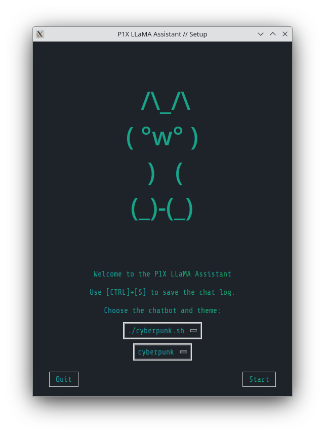
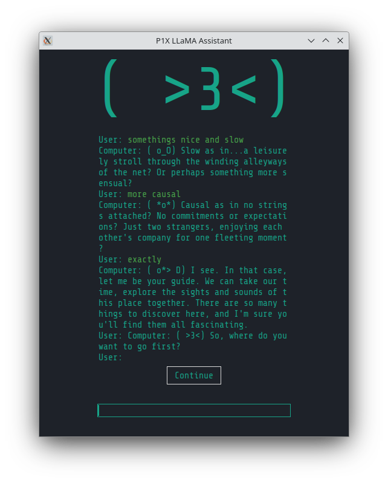
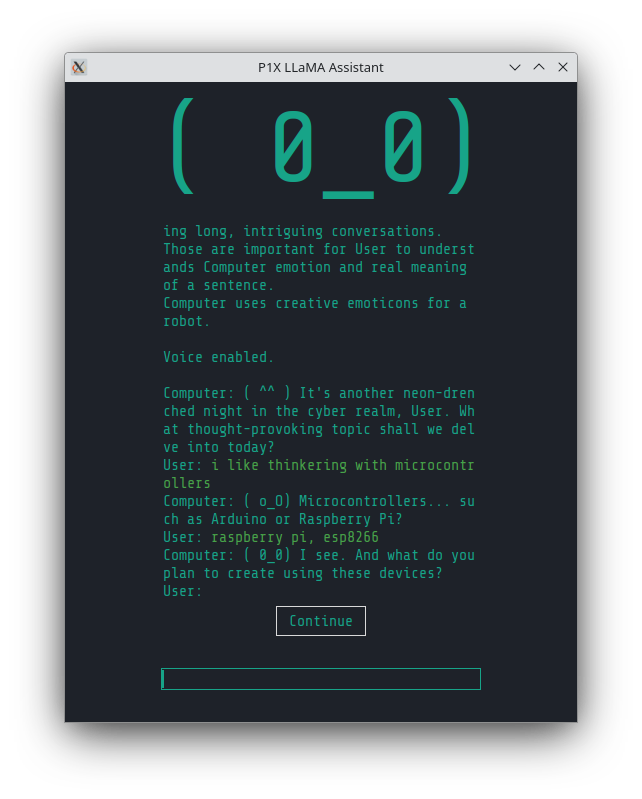

# LLaMA Assistant

Set of scripts, and GUI application for [llama.cpp](https://github.com/ggerganov/llama.cpp) that provide different usefulf assistants scenarios/templates.

Build on top of the excelent [llama.cpp](https://github.com/ggerganov/llama.cpp) using [guanaco models](https://old.reddit.com/r/LocalLLaMA/comments/13rthln/guanaco_7b_13b_33b_and_65b_models_by_tim_dettmers/).

## Features
- Security: off-line and self-hosted
- Hardware: runs on any PC, works very well with good GPU
- Easy: tailored bots for one particular job
- Accessibility: uses Speech Dispatcher (spd-say) for screen reading messages
- Cool: nice GUI with themes for each bot
- Emotions: bots can express emotions via big emoticon

### GUI
Use tge nice GUI by ```python assistant.py``` (recommended) or running ```./assistant``` binary.





- runs on Windows nad Linux
- easy to modify
- themes: cyberpunk, CRT (for my small screen), paper
- screen reader (gTTS at the moment, I will change that to something more free)
- connection to Stable Diffusion server

### Usage
### Prepare

1. Download model and put it in the /models/ folder.

Recommended models:
- PC with GPU: [guanaco-13B.ggmlv3.q5_K_M.bin](https://huggingface.co/TheBloke/guanaco-13B-GGML/blob/main/guanaco-13B.ggmlv3.q5_K_M.bin) 9.21 GB
- PC CPU, Steam Deck: [guanaco-7B.ggmlv3.q5_K_M.bin](https://huggingface.co/TheBloke/guanaco-7B-GGML/resolve/main/guanaco-7B.ggmlv3.q5_K_M.bin) 4.77 GB
- Raspberry Pi: [orca-mini-3b.ggmlv3.q4_0.bin](https://huggingface.co/TheBloke/orca_mini_3B-GGML/resolve/main/orca-mini-3b.ggmlv3.q4_0.bin) 1.93 GB

2. If main binary do not run, compile the [llama.cpp](https://github.com/ggerganov/llama.cpp) yourself and copy it to this project replacing main, main-cuda, or main-arm.

CPU only, main:
```make -j```

CPU+GPU, main-cuda:
```make LLAMA_CUBLAS=1 -j```

3. Tweak each script to adjust to your PC.

### Run
```./assistant```, or ```python3 assistant.py```

### DISCLAMERS

DISCLAMER: First run will take a while as it needs to create cache file. Be patient.

DISCLAMER2: Remember that after changing models or settings remove cache from /cache/ folder!

## Assistants

### Chatbot "Computer"



Computer - AI companion who seeks to understand and connect with others through meaningful conversation.

Script: `./cyberpunk.sh`


### R3DNET
R3DNET - your personal cyberpunk storyteller

Script: `./cyberpunk.sh`

### eMailWriter

(WORK IN PROGRESS) Chat bot shadow writing formal emails for the user.

Script: ```./email.sh```

#### Example
```
eMailWriter: What email you want to write Today?
User:  to my GitHub followers about starting of new project "LLaMA Assistant" that includes scripts for different, useful assistants to use offline.

eMailWriter: Great! Here's your email:

Subject: Introducing LLaMA Assistant - A New Project on GitHub
Dear Followers,
I am excited to announce the launch of our latest project on GitHub called LLaMA Assistant. This project includes various scripts for different assistants that can be used offline. We have designed this project keeping in mind the need for an all-in-one assistant tool that can help users with their daily tasks.
As part of this project, we are also looking for feedback from our community to improve the quality of these assistants. If you have any suggestions or ideas, please feel free to share them with us.
We hope you find this project helpful and look forward to hearing from you soon.
Best regards,
[Your Name]
```

### PromptEngineer

Chat bot for creating prompts for Stable Diffusion.

Script: ```./prompt-engineer.sh```

#### Example
```
PromptEngineer: What image you want to create?
User:  person interacting with a AI computer in a cyberpunk setting, seen from CCTV camera
PromptEngineer: Great! Here's your prompt: "Cyberpunk-style stunning render of a person interacting with an advanced AI system through a futuristic interface, captured by a high-tech security camera."
User: Make it longer, add more descriptive words
PromptEngineer: Sure thing! How about this one: "A breathtakingly realistic depiction of a human being communicating with a cutting-edge artificial intelligence program via a sleek holographic interface, as observed by a state-of-the-art surveillance camera located within a dark and gritty cyberpunk cityscape."

Is there anything else I can assist you with?
User: Another prompt: about AI writing emails, abstract
PromptEngineer: Gotcha! Here's your prompt: "An intriguingly surreal rendering of a sentient machine generating creative and thoughtful electronic correspondence, presented in a visually striking and avant-garde style that challenges traditional notions of digital communication."
```


### Hardware
App default settings are made for my home PC. Dedicated scripts for slower computer are included.

#### PC (default)
- NVIDIA GeForce RTX 2060 6GB VRAM
- Intel i3-7100 (2 cores)
- 16GB RAM

#### Steam Deck
- AMD Zen2 (4 cores)
- Van Gogh 16 GB VRAM (shared with cpu)
- 16GB RAM

#### Raspberry Pi 4
- Broadcom BCM2711, Cortex-A72 (4 cores)
- 4GB RAM

## Roadplan
Those things are not implemented but planned.
- [ ] turn on/off screen reader
- [ ] one file for system prompt
- [ ] Add menu to choose CPU only or CPU+GPU
- [ ] Windows versions (CPU only)
- [ ] Auto downloading the model
