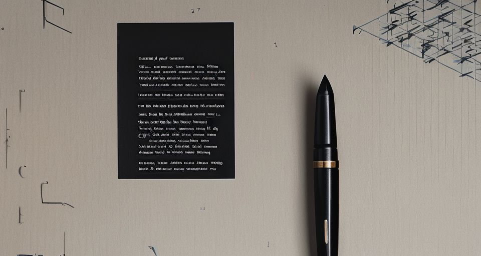
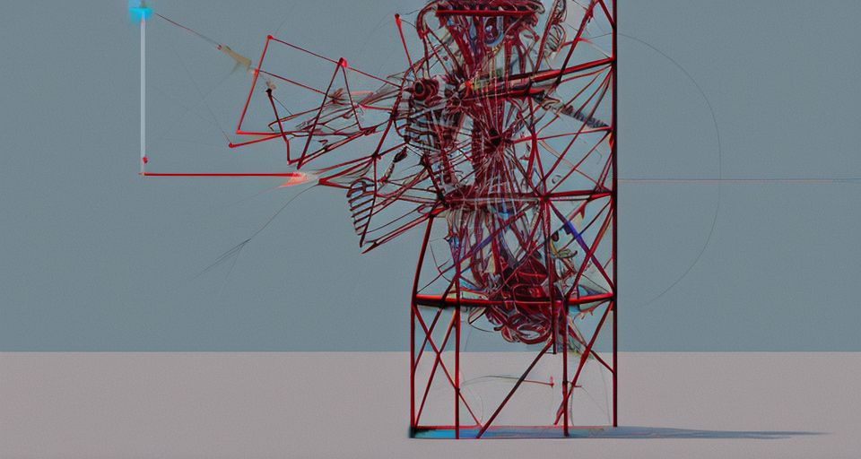

# LLaMA Assistant


Set of scripts for llama.cpp that provide different usefulf assistants scenarios/templates.

## Features
- Security: off-line and self-hosted
- Hardware: runs on any PC, works very well with good GPU
- Easy: tailored bots for one particular job

## Assistants

### eMailWriter


Chat bot shadow writing formal emails for the user.

Script: ```./email.sh```

#### Example
```
eMailWriter: What email you want to write Today?
User:  to my GitHub followers about starting of new project "LLaMA Assistant" that includes scripts for different, useful assistants to use offline.

eMailWriter: Great! Here's your email:

Subject: Introducing LLaMA Assistant - A New Project on GitHub
Dear Followers,
I am excited to announce the launch of our latest project on GitHub called LLaMA Assistant. This project includes various scripts for different assistants that can be used offline. We have designed this project keeping in mind the need for an all-in-one assistant tool that can help users with their daily tasks.
As part of this project, we are also looking for feedback from our community to improve the quality of these assistants. If you have any suggestions or ideas, please feel free to share them with us.
We hope you find this project helpful and look forward to hearing from you soon.
Best regards,
[Your Name]
```

### PromptEngineer


Chat bot for creating prompts for Stable Diffusion.

Script: ```./prompt-engineer.sh```

#### Example
```
PromptEngineer: What image you want to create?
User:  person interacting with a AI computer in a cyberpunk setting, seen from CCTV camera
PromptEngineer: Great! Here's your prompt: "Cyberpunk-style stunning render of a person interacting with an advanced AI system through a futuristic interface, captured by a high-tech security camera."
User: Make it longer, add more descriptive words
PromptEngineer: Sure thing! How about this one: "A breathtakingly realistic depiction of a human being communicating with a cutting-edge artificial intelligence program via a sleek holographic interface, as observed by a state-of-the-art surveillance camera located within a dark and gritty cyberpunk cityscape."

Is there anything else I can assist you with?
User: Another prompt: about AI writing emails, abstract
PromptEngineer: Gotcha! Here's your prompt: "An intriguingly surreal rendering of a sentient machine generating creative and thoughtful electronic correspondence, presented in a visually striking and avant-garde style that challenges traditional notions of digital communication."
```

### P1XBOT


A generic chat bot with frendly vibe.

Script: ```./chatbot.sh```

### Usage
### Prepare
Download model and put it in the /models/ folder. You need to create that folder first.

Recommendeed models from [WizardVinunaLM](https://github.com/melodysdreamj/WizardVicunaLM):
- [Wizard-Vicuna-13B-Uncensored.ggmlv3.q5_K_M.bin](https://huggingface.co/TheBloke/Wizard-Vicuna-13B-Uncensored-GGML/resolve/main/Wizard-Vicuna-13B-Uncensored.ggmlv3.q5_K_M.bin) 9.21GB

### Run
Just run selected script and start chatting.
```
./chatbot.sh
```

DISCLAMER: First run will take a while as it needs to create cache file. Be patient.

### Benchmarks
For Wizard-Vicuna at q5_K_M.

#### P1X PC
- NVIDIA GeForce RTX 2060 6GB VRAM
- Intel i3-7100 (2 cores)
- 16GB RAM

Results:
- 7B model runs at **14ms** per token.
- 13B model runs at **28ms** per token.
- 30B model is out of scope

#### Beffio PC
- Intel i7-8700 (6 cores)
- NVIDIA Quadro 8000 48GB VRAM
- 32GB RAM

Results:
- 7B model runs at **7ms** per token.
- 13B model runs at **8ms** per token.
- 30B model runs at **35ms** per token.

#### Steam Deck (CPU only)
- AMD Zen2 (4 cores)
- Van Gogh 16 GB VRAM (shared with cpu)
- 16GB RAM

Results:
- 7B model runs at **134ms** per token.
- 13B model runs at **287ms** per token.
- 30B model is out of scope


## Roadplan
- [ ] checks in script to inform user about empty /models/
- [ ] Add menu to choose CPU only or CPU+GPU
- [ ] Steam Deck settings (in menu)
- [ ] Windows versions (CPU only)
- [ ] Auto downloading the model
